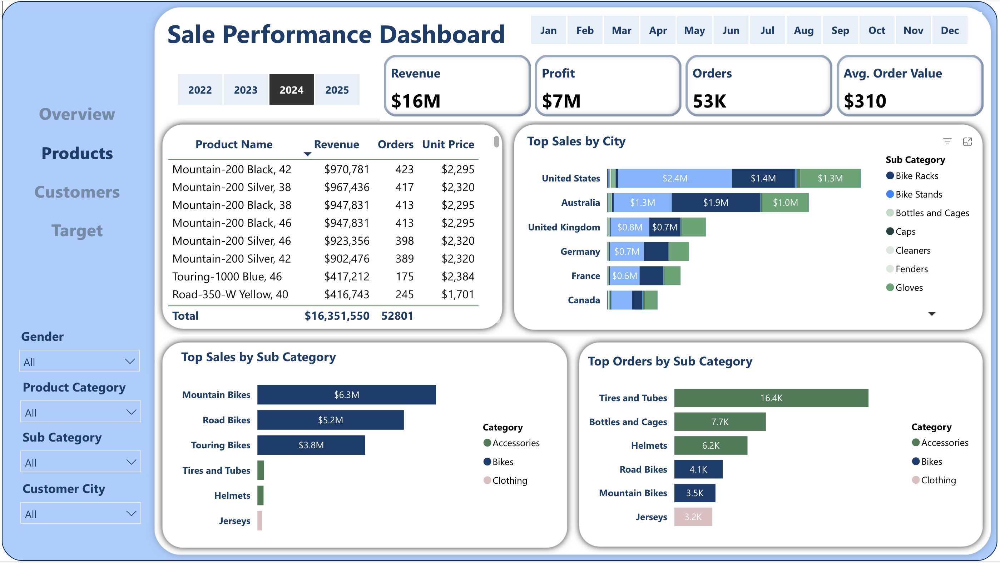

# Adventure Works Internet Sales - PowerBI Dashboard

## 📝 Project Background: 
This Power BI project explores internet sales data from AdventureWorks, covering 2022–2024. It aims to understand evolving consumer trends, evaluate product and customer performance, and project 2025 targets using scenario planning.

The analysis is structured around four core areas:
- **Sales Trends Analysis**: Revenue, Order Volume and Average Order Value (AOV).
- **Product Performance**: Top-performing products by category and region. 
- **Customer Insights**: Key customer segments by behavior and demographics.
- **Target Sales Performance**: Assessing 2024 performance, and projecting growth opportunities for 2025.

## 🔍 Interactive PowerBI Dashboard

**Explore the full interactive dashboard here → [Power BI Sales Dashboard](https://app.powerbi.com/view?r=eyJrIjoiNzdhNzdhZGMtMDI2Yy00MGM2LWE2Y2ItODhiMmZhZTQxNWEzIiwidCI6IjliZTU1MzUxLTNmMWItNGFlMy05Nzg1LWE4ZDQxNzI4YjY3ZiIsImMiOjZ9)** 

## 🧱 Data Structure
The AdventureWorks database used in this project consists of five tables with a total of approximately 100,000 records.
- Fact Table: fact_internetsales
- Budget Table: fact_budget (target revenue data for 2024)
- Dimensions:
    + dim_customers 
    + dim_products
    + dim_calendar  

Initial data analysis and validation were performed using SQL queries in SSMS to ensure data consistency, handle nulls and duplicates, and verify relationships before proceeding with modeling in Power BI.

**Access all cleaning scripts → [`/sql`](./sql)**  

## 📊 Executive Summary
Between 2022 and 2024, AdventureWorks saw strong growth in internet sales, with a **179% YoY revenue surge in 2024**, exceeding its annual target by **6.87%**. However, **Average Order Value (AOV) dropped 82%**, reflecting rising demand for **budget-friendly, high-frequency items**. While **accessories** made up **65.17% of order volume**, bikes remained the main revenue driver (70.3%). Key contributors were the **35–54 age group** and **North American buyers**, whose behaviors shaped both sales spikes and seasonal patterns.

## 📈 Insight Deep Dive
 📌 *Click each section below for detailed visuals and metrics. Each insight corresponds to a page in the Power BI Dashboard.*

### Overview Page 

Sales Trend Analysis
 

Sales grew significantly in 2024, rebounding from 2023 with a 179% year-over-year (YoY) revenue increase and a 16x surge in order volume.

→ However, this growth came with an 82% drop in Average Order Value (AOV), indicating a shift toward **lower-priced, high-frequency items**.

Seasonal peaks occurred consistently in June and December:
    
- June 2024 sales rose 68% YoY, contributing 10% to annual revenue, and exceeded the monthly target by 49.3%. → Likely driven by outdoor activity demand in North America and Europe.
    
- December performance suggested strong holiday-driven consumer behavior.

North America remained the dominant sales region throughout the entire period from 2022 to 2024.

### Product Performance Page

Product Performance Analysis

In 2024, Accessories order volume surged from 3.12% to 65.17% of total orders.

→ However, Accessories contributed only 6.18% of total revenue, reflecting growing demand for low-cost, high-frequency items.

The most frequently ordered item was the 30 oz. Water Bottle, making up 53% of all 2024 orders, followed by Tires and Tubes, Helmets, and Road Bikes.

Despite increased accessory sales, revenue remained concentrated in Bike products.
   

- In 2024:
    - Mountain Bikes generated 38.6% of total revenue. Road Bikes followed with 31.7%.
    - The Mountain Bike (Model 200 Black) was the top-selling product, contributing 17.5% of total revenue.
- Across 2022–2024, the best-selling product overall was the Red Road Bike (Model 150 Red), accounting for 19.2% of total company revenue.

   

Regionally, Bikes accounted for the vast majority of sales in key markets: 92.7% in the US, 93.3% in Australia, and 80% in the UK.

### Customer Details Page 

Customer Insights Analysis
 

- **High-Value Customers**: Age 55–73, place 10–14 orders/year, earn $80K–$100K, and are mostly in professional or management roles.
→ These segments drive the largest share of revenue.

- **High-Engagement Segments**:
Younger customers (25–35) with 60–68 orders/year, earning ~$70K–$80K, show strong engagement but lower AOVs.

- AOV by Marital Status: In the middle-income range, the difference is more prominent ($662 vs. $480).

    - Single customers: AOV of $569

    - Married customers: AOV of $480

- AOV by Occupation:

    - Professional/Managerial: AOV > $500

    - Clerical/Skilled/Manual Labor: AOV ≈ $400

- The 35–54 age group is the most active segment: Contributing 54.9% to the company's revenue and 51.7% of total orders.

- Popular Products Across All Ages:
    - 30 oz. Water Bottle
    - Sport Helmet – 100 Red
    
    → Suggests strong, consistent preference for affordable, functional accessories.

### Target Page

Target Sales Performance
 

#### **Performance Review** 

In 2024, the company achieved $16.35M in internet sales, exceeding its annual revenue target of $15.3M by 6.87%. Monthly performance varied throughout the year:

- Strong overperformance: June (+49.3%), November (+18.7%), and October (+11.5%)

- Moderate performance: January through May (3%–16% above target)

- Underperformance: July (–8.5%), September (–3.5%), December (–6.3%)

These trends reflect the influence of seasonality, consumer behavior shifts, and changing product preferences 

#### **2025 Forecast Approach**

To plan for 2025, we use a scenario-based projection strategy, incorporating both historical performance trends and market behavior in 2024.

#### **2025 Monthly Revenue Projection by Scenario**

## Recommendations: 
Based on the insights uncovered, the following recommendations are provided:
- With accessories accounting for 65.17% of orders (e.g., 30 oz. Water Bottle at 53%) but only 6.18% of revenue, **run targeted campaigns for popular low-cost, high-frequency items** like water bottles and helmets.

- Introduce **bundle promotions during seasonal peaks** (e.g., June: +68% YoY, December: holiday spike) by pairing accessories with bikes (e.g., Mountain Bike Model 200 Black, 17.5% of revenue) to boost AOV and cross-sell.

- **Personalize offers for the 35–54 age group** (54.9% of revenue, 51.7% of orders), focusing on North America (92.7% bike sales) and customers in professional roles (AOV > $500).

- Develop **entry-level offers for high-volume customers** (60–68 orders/year, $70K–$80K income, mostly married), then upsell to bikes through lifecycle promotions.

